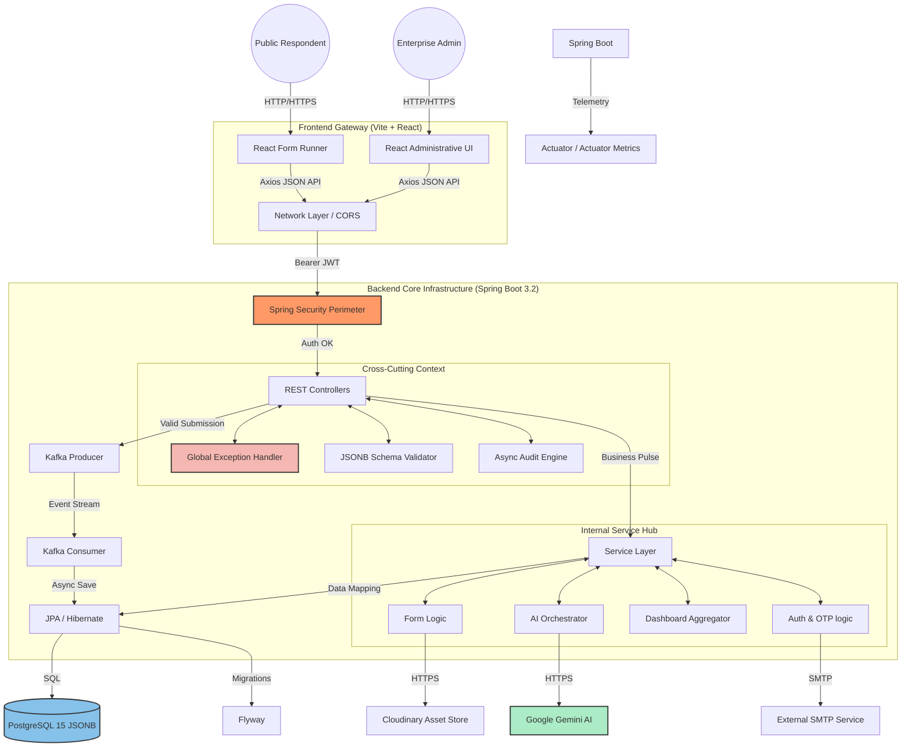
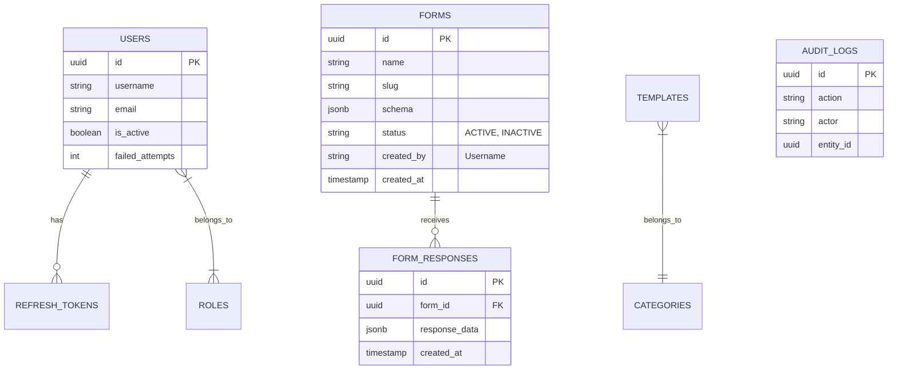
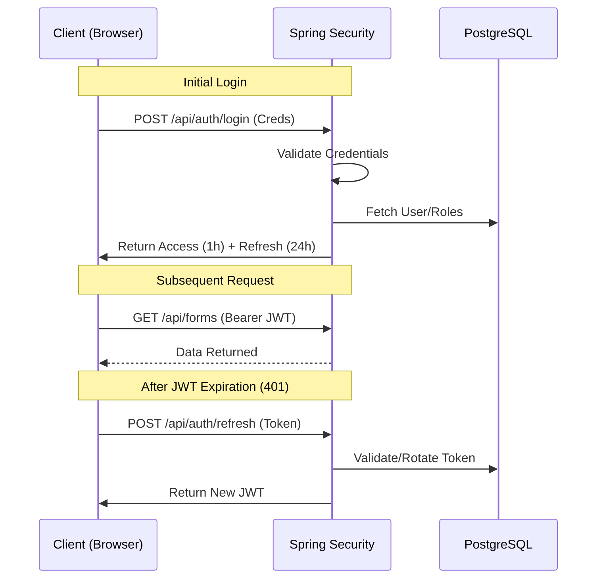
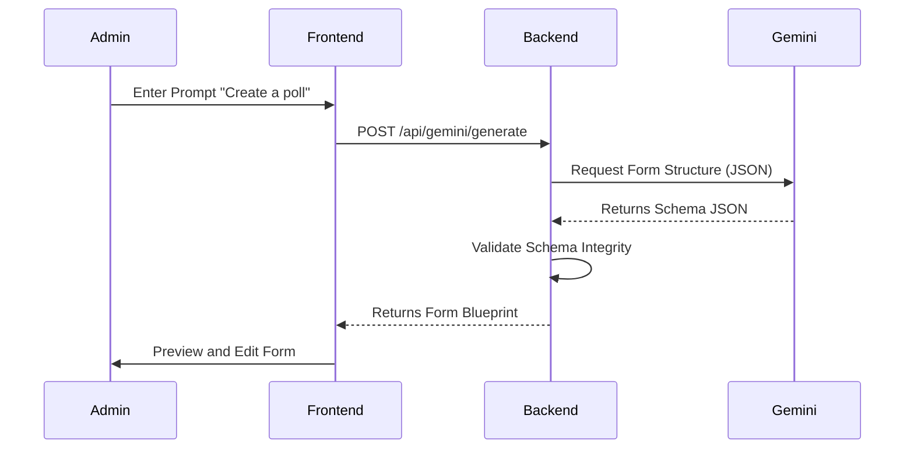
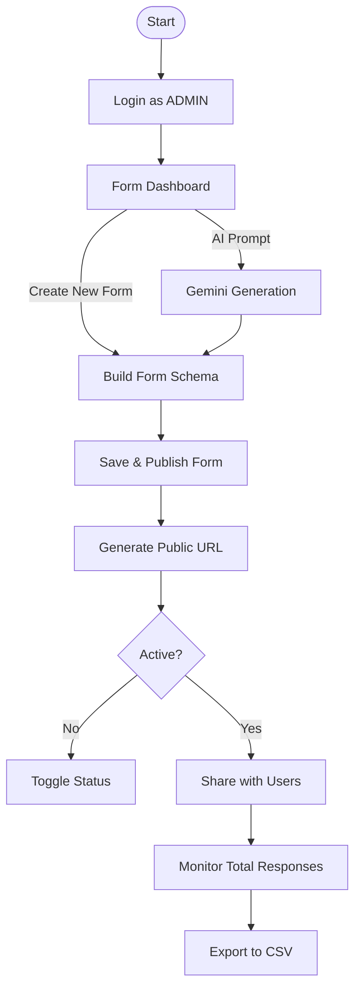
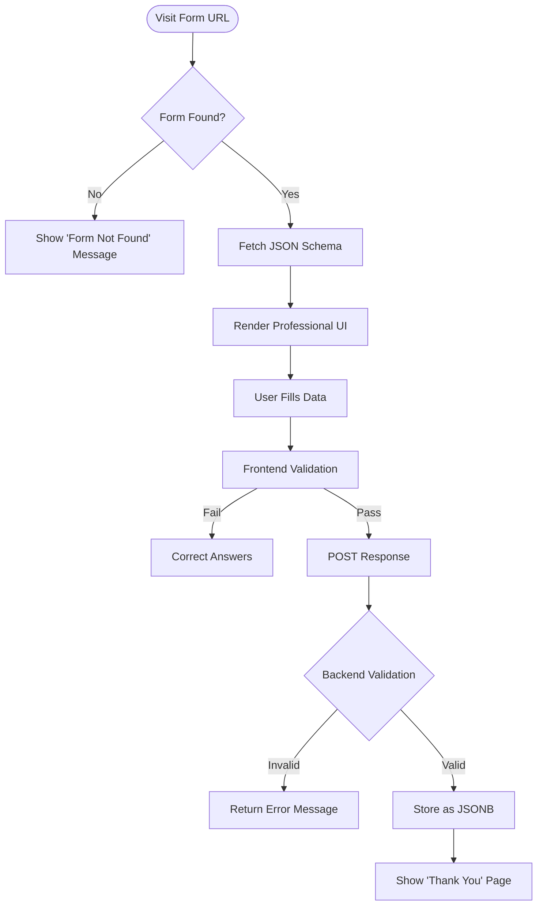

# System Architecture

**FormCraft** is a multi-tier, enterprise-class application architecture designed for scalability, security, and dynamic data modeling.

---

## 🏛 High-Level Architecture

FormCraft adheres to the **Layered Architecture Style** on the backend and uses a **Functional React Pattern** on the frontend. Communication between the frontend and backend is managed over a **RESTful JSON API**.

### System Components

1.  **Frontend (React + Vite)**: A modern, high-performance web interface using Tailwind CSS for styling and React Context + Axios for state and data management.
    - **Visual Prototype Engine**: Hover-activated, high-fidelity template previews using `framer-motion` and `AnimatePresence`.
    - **Professional Design Protocol**: Consistent 6px border radius and Google Forms-inspired clean precision.
2.  **API Gateway / Backend (Spring Boot)**: A stateless microservice handling authentication, business logic, AI orchestration, and database access.
3.  **Database (PostgreSQL 15)**: A relational storage layer with optimized support for unstructured JSONB data for dynamic form modeling.
4.  **External Services**:
    - **Google Gemini AI**: Facilitates natural language form generation.
    - **Cloudinary**: Handles high-performance image and file storage.

### **The FormCraft "Unified Blueprint" (System Architecture)**

This diagram provides an industry-standard mapping of the request processing pipeline, security perimeter, and the high-performance integration layer.

---

## 🗄 Data Model & Schema

One of FormCraft's most powerful features is its hybrid data model:
- **Relational Integrity**: Core entities like `Users`, `Roles`, and `Forms` use traditional SQL relations.
- **JSONB Flexibility**: Form structure (`schema`) and Form submissions (`response_data`) are stored as JSONB to allow for arbitrary field depth.
- **Dynamic Terminology**:
    - **Total Responses**: Tracks community engagement (formerly 'Captured Yield').
    - **Total Questions**: Measures form architecture density (formerly 'Logic Blocks').
- **Advanced Validation Rules**: Our JSONB schemas support extensive rules including `required`, `type`, `min`, `max`, `minLength`, `maxLength`, and `regex` with custom error messages.
- **Form Lifecycle Management**: Forms include `active` status with optional `startDate` and `expiryDate` for automatic scheduling.

### Schema Blueprint (Mermaid Diagram)

---

## 🔐 Security Architecture

FormCraft implements a **zero-trust** security model using stateless **JWT (JSON Web Tokens)**.

### Authentication Flow (Sequence Diagram)

1.  **Authentication**:
    - **Initial Login**: Exchanges credentials (username/password) for an Access Token (short-lived) and a Refresh Token (long-lived).
    - **Token Rotation**: The client uses the Refresh Token to obtain new Access Tokens automatically upon expiry.
2.  **Authorization**:
    - **RBAC (Role-Based Access Control)**: Endpoints are secured using `@PreAuthorize` based on roles (`ROLE_ADMIN`, `ROLE_USER`).
3.  **Auditing**:
    - Automatic recording of `createdBy`, `updatedBy`, `createdAt`, and `updatedAt` for every entity using Spring Data Envers/Auditing.

---

## 💡 AI Core: Google Gemini Integration

The AI engine allows users to describe a form (e.g., *"Create a registration form for a marathon with medical history and emergency contact"*).

### AI Logic Flow

- **Flow**: Frontend prompt → Backend → Gemini API → JSON Form Schema → Database.
- **Outcome**: A fully functional, validated form schema ready for distribution.

---

## 🛡️ Governance & Role-Aware Dashboard

FormCraft provides localized control centers based on user roles, enabling streamlined administrative workflows.

### Deep-Link Governance
- **Super Admins**: See a "Promotion Alerts" feed for pending template requests. Clicking "Approve Now" deep-links to the Template Hub with the `requested` filter pre-applied.
- **Standard Users**: See operational metrics (Drafts, Expiry). Clicking "Total Drafts" deep-links to the Form Builder and automatically triggers the **Draft Gallery**.

---

## 🔄 User Workflow Flowcharts

### Admin: Form Creation & Management

### Public: Form Submission Workflow

## 🏗 Technology Stack Decisions

- **Why JSONB?** To avoid `ALTER TABLE` operations every time a user adds a new field to a form.
- **Why Spring Security?** For industry-leading, battle-tested authentication and high-integrity session management.
- **Why Tailwind CSS?** To maintain a cohesive design system without bloat components.
- **Why 6px Radius?** To project an established, enterprise-class professional identity throughout the application UI.
