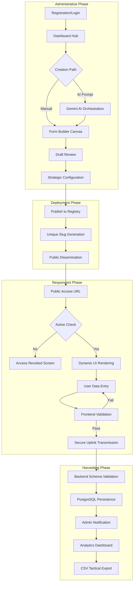
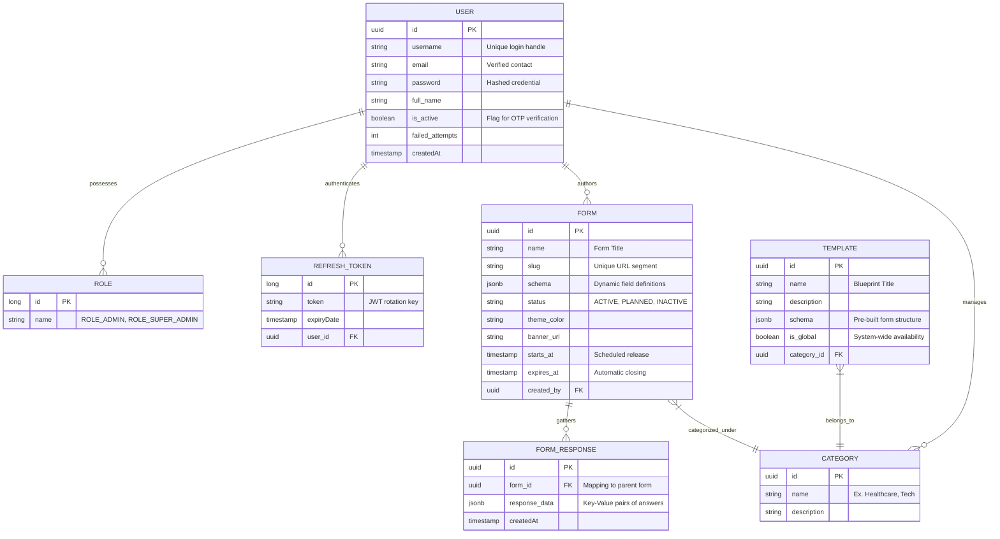
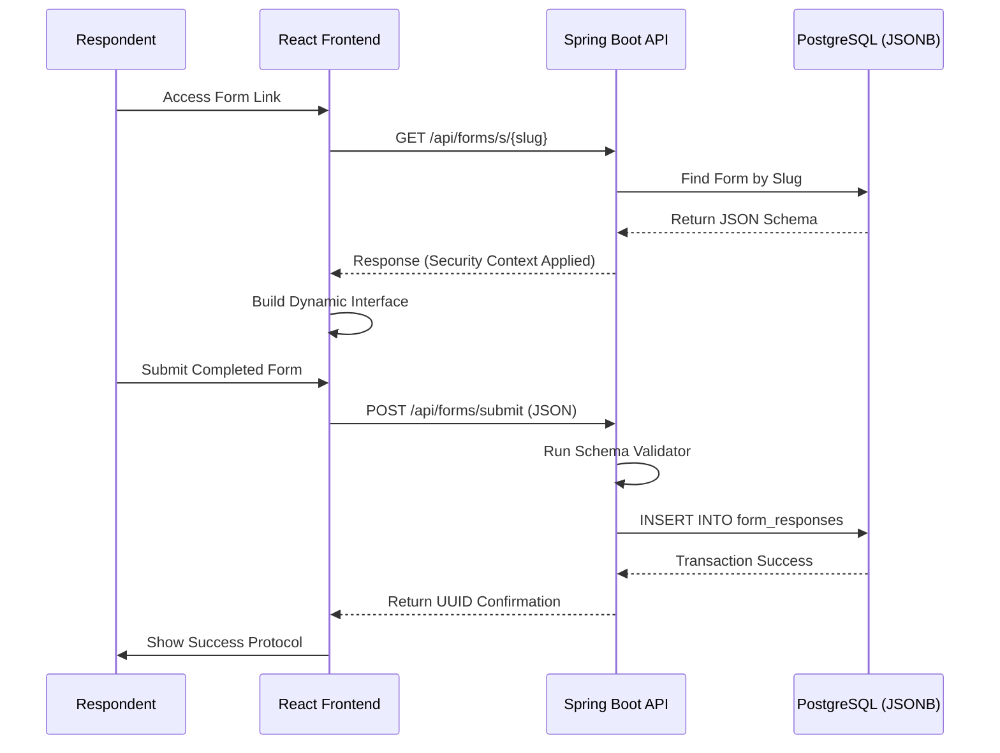

# 📊 Project Flow & Data Mapping

This document provides a high-level visual representation of **FormCraft's** operational logic and its underlying data architecture.

---

## 🔄 Project Operational Flow

This flowchart illustrates the end-to-end lifecycle of a form, from administrative initialization to respondent data harvesting.

---

## 🗄 Data Entity Mapping (ERD)

FormCraft uses a **Hybrid Relational-JSON** model. Core metadata is stored in strict SQL columns, while dynamic form structures and user responses are stored in optimized **JSONB** containers.

---

## 📡 Request Sequence (Auth + Data)

Visualizing the secure transaction between the React Client and the Spring Boot Kernel.

